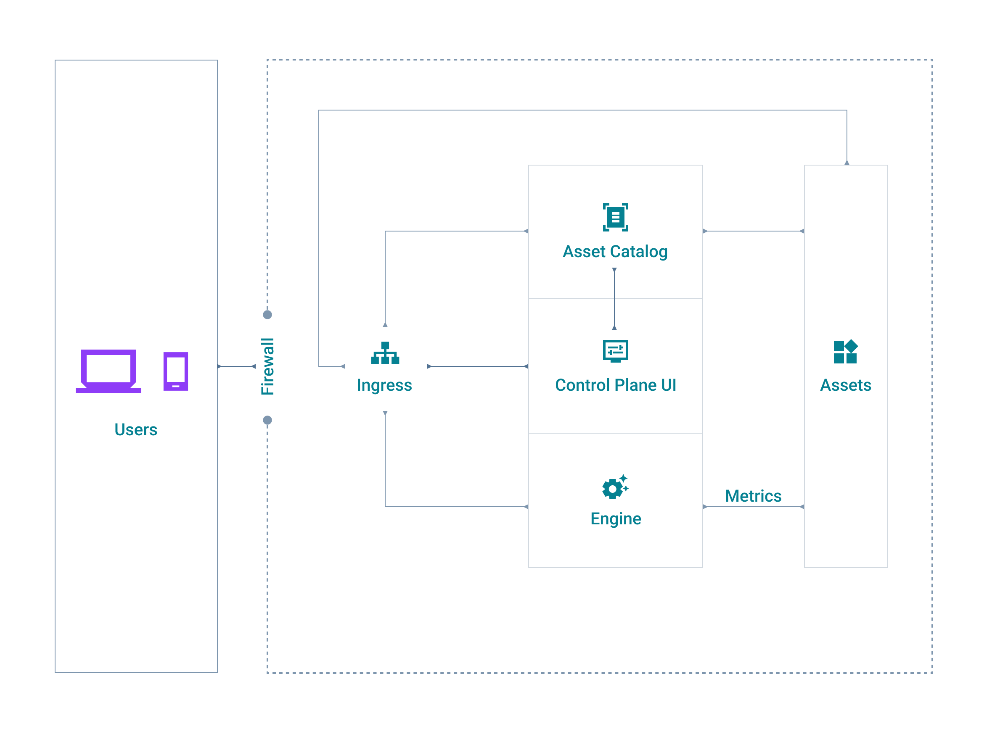

# API Control Plane deployment with helm

The instructions for installing and running the API Control Plane on kubernetes using helm are below.

The standard deployment of API Control plane contains the following 5 microservices.


1. Asset catalog - Assets(Runtimes,Data planes) processing of Control plane.
2. Engine - Metrics processing and aggregation.
3. Ingress - User management and security
4. API Control Plane UI - user interface
5. Elasticsearch - data persistence layer

***

Table of contents

1. [Prerequisite](#Prerequisite)
2. [How to deploy IBM webMethods API Control Plane using helm?](#how-to-deploy-webmethods-api-control-plane-using-helm)
3. [How to stop IBM webMethods API Control Plane using helm?](#how-to-stop-webmethods-api-control-plane-using-helm)
4. [How to access the newly deployed IBM webMethods API Control Plane?](#how-to-access-the-newly-deployed-webmethods-api-control-plane)
5. [Additional deployment flavors](#additional-deployment-flavors)

***
## Prerequisite
The machine needs following to install the control plane through helm.
1. kubernetes
2. helm
3. nginx Ingress Controller

   Refer [here](#nginx installation) for the installation of nginx ingress

***

## How to deploy IBM webMethods API Control Plane using helm?

4. Refer https://docs.webmethods.io/on-premises/webmethods-api-control-plane/en/11.1.0/webhelp/index.html#page/wco-webhelp%2Fco-deploy_standalone_apicp.html to pull control plane images from IBM container registry.

5. Configure your deployment

    The [values.yaml](values.yaml) file allows to configure different aspects of API Control Plane deployment. To be able to access API Control Plane after it's deployed, you need to edit this file and provide a value for `domainName` that matches the hostname of the machine you're deploying API Control plane on. Make sure this hostname is accessible to whoever will be connecting to API Control Plane.

    If you don't want to use the `latest` version and prefer a specific one, make sure to update the [values.yaml](values.yaml) file for appropriate versions of the docker image you want to use for ingress, ui, engine and asset catalog applications. Go [here](https://github.com/orgs/SoftwareAG/packages?repo_name=webmethods-api-control-plane) so see what's available.

    Default configuration is set up to deploy 2 replicas of API Control Plane containers and 1 replica for others. Edit the values.yaml file to change that as needed.

6. Execute the deployment script

    To deploy the API Control Plane with default configuration:

    - change to deployment/docker directory:

        ```bash
        cd deployment/helm
        ```

    - execute the deployment script

        ```bash
        helm upgrade --install --create-namespace --namespace control-plane --wait --timeout 5m0s control-plane .
        ```

    If everything goes well, the output should be similar to this

    ```bash
    [user@somehost helm]$ helm upgrade --install --create-namespace --namespace control-plane --wait --timeout 5m0s control-plane .
    Release "control-plane" does not exist. Installing it now.
    NAME: control-plane
    LAST DEPLOYED: Fri Apr  7 11:37:53 2023
    NAMESPACE: control-plane
    STATUS: deployed
    REVISION: 1
    TEST SUITE: None
    ```
  
7. Verify it's started

    It will take a couple of minutes to start. You can monitor that with solutions like Portainer or Docker\Kubernetes Dashboard etc. or simply user Docker\Kubernetes CLI like this

    ```bash
    [user@somehost helm]$ kubectl get all -n control-plane
    NAME                               READY   STATUS    RESTARTS   AGE
    pod/assetcatalog-75d94cff5-7bmkk   1/1     Running   0          5m43s
    pod/assetcatalog-75d94cff5-vrsxm   1/1     Running   0          5m43s
    pod/elasticsearch-0                1/1     Running   0          5m43s
    pod/engine-57967b46c4-5b5kg        1/1     Running   0          5m43s
    pod/engine-57967b46c4-92pnz        1/1     Running   0          5m43s
    pod/ingress-7d4567dcf8-grrrp       1/1     Running   0          5m43s
    pod/ingress-7d4567dcf8-jnrwt       1/1     Running   0          5m43s
    pod/ui-6c8d58d754-bc7s5            1/1     Running   0          5m43s
    pod/ui-6c8d58d754-l5qcs            1/1     Running   0          5m43s

    NAME                             TYPE        CLUSTER-IP      EXTERNAL-IP   PORT(S)    AGE
    service/assetcatalog-svc         ClusterIP   10.43.72.67     <none>        8080/TCP   5m43s
    service/elasticsearch-headless   ClusterIP   None            <none>        9300/TCP   5m43s
    service/elasticsearch-lb         ClusterIP   10.43.31.70     <none>        9200/TCP   5m43s
    service/engine-svc               ClusterIP   10.43.19.194    <none>        8080/TCP   5m43s
    service/ingress-svc              ClusterIP   10.43.111.144   <none>        8080/TCP   5m43s
    service/ui-svc                   ClusterIP   10.43.66.124    <none>        8080/TCP   5m43s

    NAME                           READY   UP-TO-DATE   AVAILABLE   AGE
    deployment.apps/assetcatalog   2/2     2            2           5m43s
    deployment.apps/engine         2/2     2            2           5m43s
    deployment.apps/ingress        2/2     2            2           5m43s
    deployment.apps/ui             2/2     2            2           5m43s

    NAME                                     DESIRED   CURRENT   READY   AGE
    replicaset.apps/assetcatalog-75d94cff5   2         2         2       5m43s
    replicaset.apps/engine-57967b46c4        2         2         2       5m43s
    replicaset.apps/ingress-7d4567dcf8       2         2         2       5m43s
    replicaset.apps/ui-6c8d58d754            2         2         2       5m43s

    NAME                             READY   AGE
    statefulset.apps/elasticsearch   1/1     5m43s
    ```

###### [Back to Top](#api-control-plane-deployment-with-helm)
***

## How to access the newly deployed IBM webMethods API Control Plane?

1. Open your browser and go to `https://[the-host-you-configured]/` or `http://[the-host-you-configured]/` (Unsecured)
2. You should see the login screen. Log in using Administrator username and the default password.

###### [Back to Top](#api-control-plane-deployment-with-helm)

***

## How to stop IBM webMethods API Control Plane using helm?

To stop and remove the API Control Plane default configuration:

- change to deployment/helm directory:

    ```bash
    cd deployment/helm
    ```

- execute the deployment script

    ```bash
    helm uninstall control-plane -n control-plane
    ```

If everything goes well, the output should be similar to this

```bash
[user@somehost helm]$ sudo /usr/local/bin/helm uninstall control-plane -n control-plane
release "control-plane" uninstalled
```

###### [Back to Top](#api-control-plane-deployment-with-helm)
***

## Additional deployment flavors

### 1. Enabling Open Telemetry using Jaeger

API Control plane can be started in debug mode with Open telemetry enabled and exposed using [Jaeger UI](https://www.jaegertracing.io/). For this, the deployment needs additional image, namely `jaegertracing/all-in-one`.

To enable it set the property `applications.jaegertracing.enabled` to `true` in `values.yaml` file (line 111).

```yaml
  jaegertracing:
    enabled: true
    name: jaeger-tracing
    #--- Jaeger Tracer image name
    imageName: jaegertracing/all-in-one
    #--- Jaeger Tracer image tag
    imageTag: latest
    #--- Jaeger Tracer image replicas number
    replicas: 1
    #--- Port to run Jaeger.
    port : 4317
    #--- UI Port in which Jaeger is exposed
    uiPort: 16686
     #--- Node Port to access JaegarUI outside the cluster 
    extPort: 30007
    storage: 2Gi
    resources:
      # This is just an example. This should be a consious choice of the user. Refer
      # https://raw.githubusercontent.com/hansehe/jaeger-all-in-one/master/helm/jaeger-all-in-one/values.yaml
      limits:
        cpu: 100m
        memory: 128Mi                                                     
      requests:
        cpu: 100m
        memory: 128Mi
    # - Enable to use volume mapping for Jaeger    
    volume:
      enabled: false
      className: ""
      size: 3Gi

```

:wave: The Jaeger UI can be accessed via the `applications.jaegertracing.extPort` port (NodePort type) configured in the `values.ymal` file.

:wave: The Jaeger deployment here is a stateless deployment. Please refer to https://github.com/hansehe/jaeger-all-in-one/tree/master/helm for the complete production level deployment of Jaeger.

### 2. Enabling Gainsight integration

If you want to see [Gainsight](https://www.gainsight.com/product-experience/) powered user engagements (work in progress) in API Control Plane like bots, articles, feature introduction etc., you need to provide additional configuration set up in `values.yaml` file. Please contact your Software AG API Control Plane contact or ask us here for the proper configuration values.

To enable Gainsight integration set `applications.gainsight.enabled` to `true` in `values.yaml` file (line 142). Values for the remaining attributes will be provided to you by Software AG.

```yaml
  gainsight:
    enabled : true
    tenant:
      name: "ACME Inc"
      cloudProvider: "Azure"
      region: "US West Oregon"
      plan: "Free"
      stage: "Staging"
      key: "secret"
```

### 3. Enabling secure Elasticsearch communication

To enable secure communication to Elastic, proper certificates needs to created as kubernetes secrets and provided to the microservices.
Please refer to
https://github.com/elastic/helm-charts/blob/main/elasticsearch/examples/security/values.yaml
https://github.com/lisenet/kubernetes-homelab/tree/master/logging 
to enable Elasticsearch over SSL.

###### [Back to Top](#api-control-plane-deployment-with-helm)
***

## nginx installation
Follow the below steps to install the nginx Ingress Controller. Also refer [here](https://docs.nginx.com/nginx-ingress-controller/installation/installing-nic/installation-with-helm/) or [here](https://gcore.com/docs/cloud/kubernetes/networking/install-and-set-up-the-nginx-ingress-controller) for more details.
```
1. kubectl create namespace ingress-nginx
2. helm repo add ingress-nginx https://kubernetes.github.io/ingress-nginx
3. helm repo update
4. helm install ingress-nginx ingress-nginx/ingress-nginx --namespace ingress-nginx --set controller.ingressClassResource.name=nginx
```

You can see an output as shown below.
```
NAME: ingress-nginx
LAST DEPLOYED: Wed Nov 22 01:30:51 2023
NAMESPACE: ingress-nginx
STATUS: deployed
REVISION: 1
TEST SUITE: None
NOTES:
The ingress-nginx controller has been installed.
It may take a few minutes for the LoadBalancer IP to be available.
You can watch the status by running 'kubectl --namespace ingress-nginx get services -o wide -w ingress-nginx-controller'
```
***

## Known issues

1. If your Kubernetes server's version is lower than 1.19, then edit the `templates\nginx_ingress.yaml` file to:

- change the `apiVersion` from 'networking.k8s.io/v1' to 'networking.k8s.io/v1beta1'.
- edit the 'backend' part fo the specification to look like this:

  ```yaml
  backend:
    # service: 
    #   name: {{ .Values.applications.ingress.name }}-svc
    #   port: 
    #     number: 8080            
    serviceName: {{ .Values.applications.ingress.name }}-svc
    servicePort: 8080
  ```

###### [Back to Top](#api-control-plane-deployment-with-helm)
***
